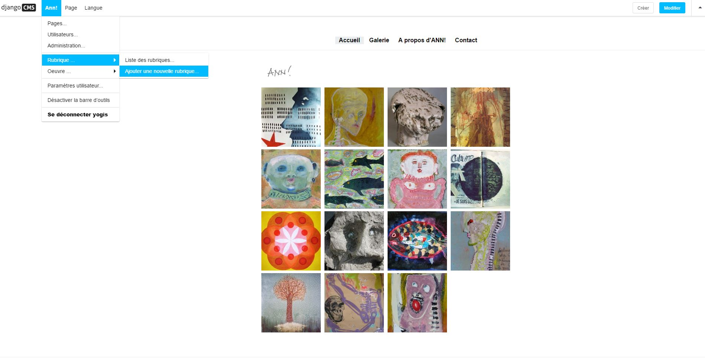
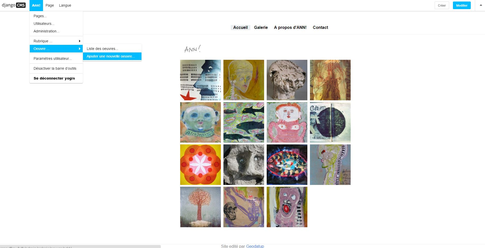
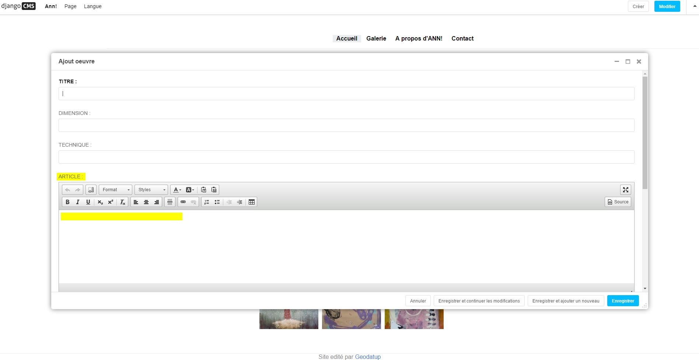

Bienvenue sur la documentation
---------

# Aller sur le site 

Pour aller sur le site il faut rensegner l'URL suivante dans la barre de recherche du navigateur :

[http://annauffray.fr](http://annauffray.fr) 

# Se connecter à l'interface d'adminitration

Pour administrer le site et son contenu, il faut rensegner l'URL suivante dans la barre de recherche du navigateur :

[http://annauffray.fr/fr/?edit](http://annauffray.fr/fr/?edit)

Il faut alors renseigner son login et mot de passe pour entrer en mode *edition*.

# Ajouter de nouvelles photos d'oeuvre
 
[http://annauffray.fr/fr/admin/filer/folder](http://annauffray.fr/fr/admin/filer/folder)

Ici, vous pouvez créer des dossiers et importer un lot d'images. Ces images seront ensuite disponible lors de la création d'une oeuvre, ainsi que pour l'icon d'une rubrique.

# Ajouter une nouvelle rubrique

Pour ajouter une rubrique il faut au préalable être en mode édition :

[http://annauffray.fr/fr/?edit](http://annauffray.fr/fr/?edit)

Puis séléctionner le menu *Ann!*, puis "Rubrique" puis "Ajouter une nouvelle rubrique"
 

# Ajouter une nouvelle oeuvre

Pour ajouter une nouvelle oeuvre il faut au préalable être en mode édition :

[http://annauffray.fr/fr/?edit](http://annauffray.fr/fr/?edit)

Puis séléctionner le menu *Ann!*, puis "Oeuvre" puis "Ajouter une nouvelle oeuvre"
.

Remplir ensuite le formulaire. 

Attention, 
Si l'oeuvre n'est pas un texte alors laissez le champs "article" vide.
Car une oeuvre peut aussi être un article (uniquement du texte). 
Si c'est le cas remplissez le champs "article". 

.

# Modifier le contenu d'une page "A propo d'Ann" ou "contact"

